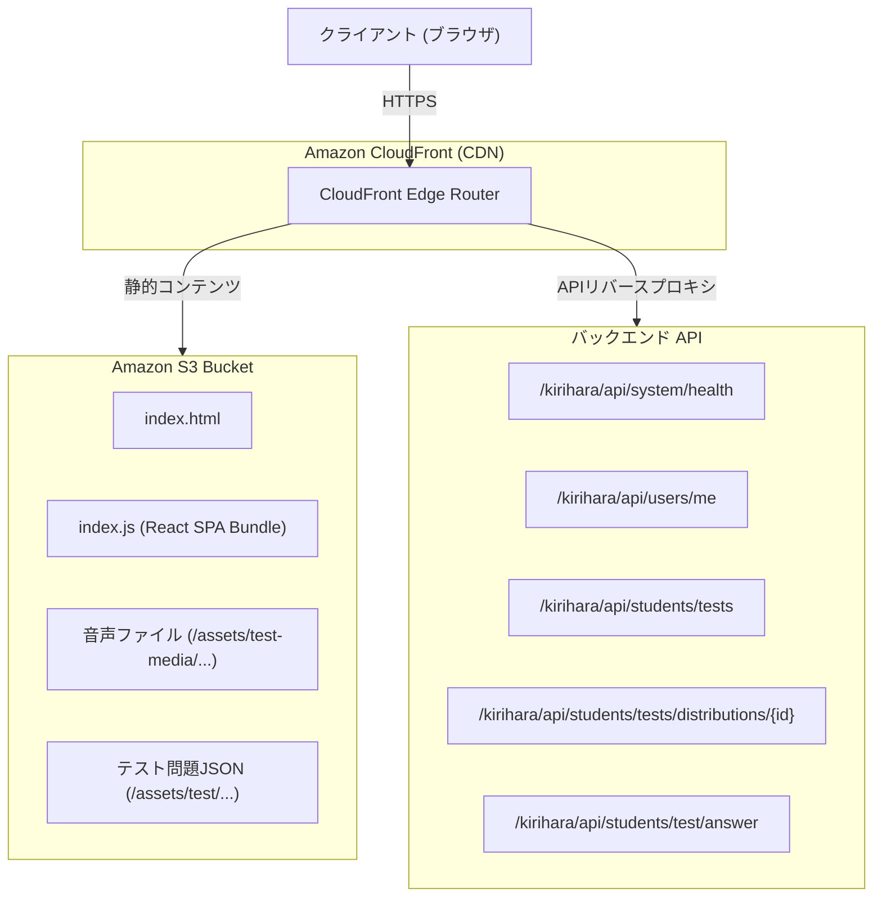

# HARファイル解析レポート (`network_capture.har`)

本ドキュメントは、提供されたHTTPアーカイブファイル（`network_capture.har`）の通信解析結果をまとめた技術資料です。

---

## 1. 概要

本HARファイルは、桐原書店の教育プラットフォーム「きりはらの森の学校（フォレストテスト 生徒用 / Moritest Students）」において、ログインから「単語テスト」の受験・解答送信、採点結果取得までの一連の通信（全21リクエスト）を記録したものです。

### キャプチャ情報
- **対象ドメイン**: `www.kirihara-morinogakko.jp`
- **総リクエスト数**: 21 エントリ
- **総転送量**: 約 2.70 MB

### HTTPメソッド内訳
- `GET`: 19 回
- `POST`: 1 回（テスト解答送信）
- `PUT`: 1 回（テスト解答初期化 / 状態同期）

### HTTPステータスコード内訳
- `200 OK`: 17 回
- `206 Partial Content`: 2 回（リスニング音声ファイルのRangeリクエスト）
- `401 Unauthorized`: 2 回（ヘルスチェックエンドポイント）

---

## 2. システム構成

- **フロントエンド**: React SPA (単一バンドル `/index.js`)
- **CDN**: Amazon CloudFront
- **ストレージ**: Amazon S3 (テスト問題JSON、リスニング音声データ)
- **セッション管理**: Cookie (`SESSION=...`)

---

## 3. 主要API仕様

### 1. `GET /kirihara/api/users/me`
- **パラメータ**: `needsUserType=true&needsUserInfo=true&needsAccessCodes=true`
- **ヘッダー**: `x-application-name: COM`
- **用途**: ログイン中ユーザー情報、所属情報、権限種別の取得。

### 2. `GET /kirihara/api/students/tests`
- **パラメータ**: `year={year}`
- **ヘッダー**: `x-application-name: KFS`
- **用途**: 指定年度の配信テスト一覧および過去スコアの取得。

### 3. `GET /kirihara/api/students/test/{distributionId}/url`
- **ヘッダー**: `x-application-name: KFS`
- **用途**: 指定テストの問題JSON静的URLを取得。

### 4. `GET /kirihara/api/students/tests/distributions/{distributionId}`
- **ヘッダー**: `x-application-name: KFS`
- **用途**: 制限時間および設問構成の確認。

### 5. `PUT /kirihara/api/students/test/answer`
- **用途**: 解答開始状態の同期。

### 6. `POST /kirihara/api/students/test/answer/submitted`
- **用途**: 解答データの一括送信および採点。
