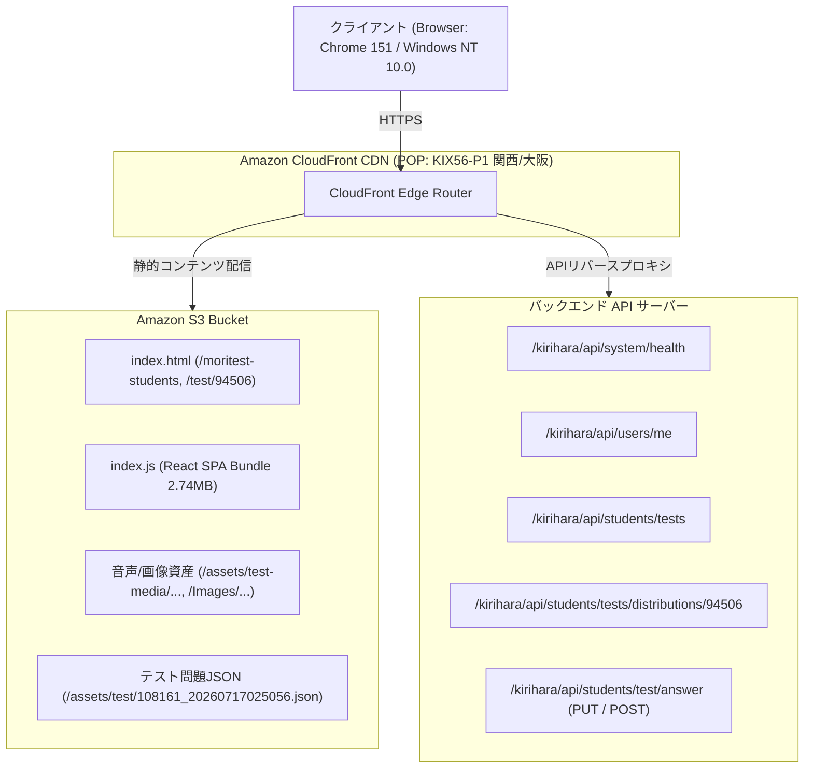
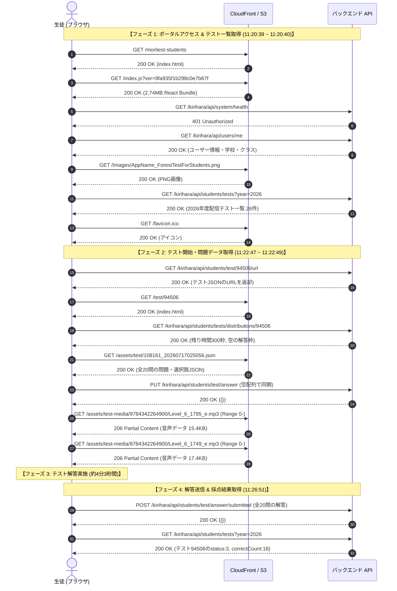

# HARファイル解析レポート (`network_capture.har`)

本ドキュメントは、提供されたHTTPアーカイブファイル（`network_capture.har`）の詳細なトラフィック解析結果をまとめたものです。（※受講者個人の特定情報のみマスキング処理を施しています）

---

## 1. 概要 (Executive Summary)

本HARファイルは、**株式会社桐原書店**が提供する教育プラットフォーム**「きりはらの森の学校（フォレストテスト 生徒用 / Moritest Students）」**において、生徒がログインし**「8月10日（月）単語テスト」を受験・解答送信して採点結果を受け取るまで**の一連の通信フロー（全21リクエスト）を記録したものです。

### 主要ハイライト
- **対象サービス**: 桐原書店「きりはらの森の学校」生徒用テストポータル (`www.kirihara-morinogakko.jp`)
- **受講生徒**: [REDACTED_SCHOOL] [REDACTED_CLASS] [REDACTED_NAME] さん (出席番号: [REDACTED_NUM])
- **受験テスト**: 『データベース3300 基本英単語・熟語』「8月10日（月）単語テスト」（制限時間: 5分 / 全20問）
- **受験結果**: **18点 / 20点（正答率 90.0%）** - 受験ステータス: 完了 (Status: 3)
- **所要時間**: 約4分3秒（開始: 11:22:48 JST → 送信: 11:26:51 JST）

---

## 2. キャプチャ基本メタデータ

| 項目 | 内容 |
| :--- | :--- |
| **ファイル名** | `network_capture.har` |
| **ファイルサイズ** | 約 5.31 MB (5,313,043 バイト) |
| **キャプチャツール** | Whistle v2.10.8 (HTTP/HTTPSプロキシ型デバッグツール) |
| **記録日時 (UTC)** | 2026-08-10 02:20:39 ～ 2026-08-10 02:26:51 |
| **記録日時 (JST)** | **2026-08-10 11:20:39 ～ 2026-08-10 11:26:51** |
| **総リクエスト数** | 21 エントリ |
| **対象ドメイン** | `www.kirihara-morinogakko.jp` (21/21) |
| **総転送量** | 約 2.70 MB |

### HTTPメソッド内訳
- `GET`: 19 回
- `POST`: 1 回（テスト解答送信）
- `PUT`: 1 回（テスト解答初期化 / 状態同期）

### HTTPステータスコード内訳
- `200 OK`: 17 回
- `206 Partial Content`: 2 回（リスニング音声ファイルのRangeリクエスト）
- `401 Unauthorized`: 2 回（ヘルスチェックエンドポイントへのアクセス拒否）

---

## 3. システム構成・インフラアーキテクチャ

HAR内のレスポンスヘッダーおよび静的ファイルから判明したシステム構成は以下の通りです。



- **フロントエンド基盤**: React (Create React App 製の Single Page Application)、単一巨大バンドル (`/index.js` 約 2.74MB)
- **CDN / キャッシュ**: Amazon CloudFront (エッジPOP: `KIX56-P1` = 関西国際空港/大阪エッジ)
- **ストレージ**: Amazon S3 (AES-256 暗号化、バージョニング有効)
- **セッション管理**: Cookie ベースのセッション (`SESSION=[REDACTED_SESSION_TOKEN]`)

---

## 4. ユーザーおよび所属情報 (個人情報マスキング済み)

`/kirihara/api/users/me` のレスポンスから特定されたアカウント情報です。

| 項目 | 値 | 備考 |
| :--- | :--- | :--- |
| **ユーザーID** | `[REDACTED_USER_ID]` | UUID形式 |
| **アカウント名** | `[REDACTED_ACCOUNT_ID]` | 生徒アカウント識別子 |
| **氏名** | `[REDACTED_STUDENT_NAME]` | |
| **都道府県** | [REDACTED_PREFECTURE] (placeId: [REDACTED]) | |
| **生年** | 20XX年 (高校1年生) | |
| **出席番号** | [REDACTED_NUM] | |
| **所属学校** | [REDACTED_SCHOOL_NAME] (学校ID: `[REDACTED_SCHOOL_ID]`) | |
| **登録クラス** | ・`[REDACTED_CLASS_1]` (classId: [REDACTED])<br>・`[REDACTED_CLASS_2]` (classId: [REDACTED]) | 有効期限: 2027-04-30 23:59 JST |
| **ユーザー権限種別** | `userType: 8` (生徒ユーザー) | MFA未設定 (`isMfa: false`) |

---

## 5. 通信シーケンス・タイムライン詳細 (全21エントリ)



### 全リクエスト詳細一覧

| # | 開始時刻 (JST) | Method | パス / URL | Status | 所要時間 | レスポンス種別・内容 |
| :---: | :---: | :---: | :--- | :---: | :---: | :--- |
| **1** | 11:20:39.232 | `GET` | `/moritest-students` | 200 | 83 ms | HTML (`index.html`) |
| **2** | 11:20:39.355 | `GET` | `/index.js?ver=9fa935f1b298c0e7b67f` | 200 | 567 ms | JS (`React SPA Bundle` / 2.74MB) |
| **3** | 11:20:39.962 | `GET` | `/kirihara/api/system/health` | **401** | 7 ms | 認証エラー (CloudFront経由) |
| **4** | 11:20:39.994 | `GET` | `/kirihara/api/users/me` | 200 | 52 ms | ユーザー情報・受講クラス |
| **5** | 11:20:40.055 | `GET` | `/Images/AppName_ForestTestForStudents.png` | 200 | 8 ms | ロゴ画像 (24.7 KB) |
| **6** | 11:20:40.090 | `GET` | `/kirihara/api/students/tests?year=2026` | 200 | 131 ms | 配信テスト一覧 (26件) |
| **7** | 11:20:40.099 | `GET` | `/kirihara/api/users/me` | 200 | 67 ms | ユーザー情報 (重複確認) |
| **8** | 11:20:40.202 | `GET` | `/favicon.ico` | 200 | 7 ms | アイコン画像 (4.4 KB) |
| **9** | 11:22:47.095 | `GET` | `/kirihara/api/students/test/94506/url` | 200 | 84 ms | テストJSON URL返却 (`108161_20260717025056.json`) |
| **10** | 11:22:48.341 | `GET` | `/test/94506` | 200 | 77 ms | HTML (テスト画面シェル) |
| **11** | 11:22:48.660 | `GET` | `/kirihara/api/system/health` | **401** | 6 ms | 認証エラー (テスト画面ロード時) |
| **12** | 11:22:48.684 | `GET` | `/kirihara/api/users/me` | 200 | 135 ms | ユーザー情報再検証 |
| **13** | 11:22:48.836 | `GET` | `/kirihara/api/students/tests/distributions/94506` | 200 | 49 ms | テスト状態 (残り300秒, 空枠) |
| **14** | 11:22:48.868 | `GET` | `/kirihara/api/users/me` | 200 | 64 ms | ユーザー情報確認 |
| **15** | 11:22:48.894 | `GET` | `/assets/test/108161_20260717025056.json` | 200 | 8 ms | テスト問題・選択肢データ (7.5 KB) |
| **16** | 11:22:48.933 | `PUT` | `/kirihara/api/students/test/answer` | 200 | 99 ms | 開始時解答状態同期 (`{testAnswers: []}`) |
| **17** | 11:22:48.936 | `GET` | `/kirihara/api/users/me` | 200 | 64 ms | ユーザー情報確認 |
| **18** | 11:22:49.030 | `GET` | `/assets/test-media/9784342264900/Level_6_1795_e.mp3` | 206 | 9 ms | リスニング音声1 (15.4 KB) |
| **19** | 11:22:49.030 | `GET` | `/assets/test-media/9784342264900/Level_6_1749_e.mp3` | 206 | 11 ms | リスニング音声2 (17.4 KB) |
| **20** | 11:26:51.643 | `POST` | `/kirihara/api/students/test/answer/submitted` | 200 | 92 ms | **テスト解答送信 (全20問)** |
| **21** | 11:26:51.794 | `GET` | `/kirihara/api/students/tests?year=2026` | 200 | 93 ms | 採点結果取得 (`correctCount: 18`) |

---

## 6. テスト内容・出題構成および解答分析

### テスト基本情報
- **テスト配信ID (distributionId)**: `94506`
- **問題セットID**: `108161` (`108161_20260717025056.json`)
- **テスト名**: ８月10日（月）単語テスト
- **対象書籍**: 『データベース3300 基本英単語・熟語』 (ISBN: `9784342264900`)
- **制限時間**: 300秒（5分00秒）
- **実施期間**: 2026-08-10 06:00:00 JST ～ 2026-08-10 23:59:00 JST

### 出題構成と解答結果

全20問の出題内容、生徒の選択肢、正誤判定の詳細です。

| 設問番号 | 大問形式 | 問題文 / 単語 | 生徒の解答 | 判定 |
| :---: | :--- | :--- | :--- | :---: |
| **Q1** | 日→英 選択 | （計画・提案など）を拒絶する | `reject` (ID: 10237657) | 正解 |
| **Q2** | 日→英 選択 | 遠い | `distant` (ID: 10237658) | 正解 |
| **Q3** | 日→英 選択 | 有罪の | `guilty` (ID: 10237664) | 正解 |
| **Q4** | 下線部和訳 | We <u>persuaded</u> her to visit us. | `に要求した` (ID: 10237667) | ❌ **不正解**<br>(正解は「を説得した」) |
| **Q5** | 下線部和訳 | The history <u>lecture</u> was interesting. | `講義` (ID: 10237673) | 正解 |
| **Q6** | 下線部和訳 | She <u>proposed</u> making a movie. | `を提案した` (ID: 10237675) | 正解 |
| **Q7** | 下線部和訳 | Our <u>genes</u> come from our parents. | `遺伝子` (ID: 10237680) | 正解 |
| **Q8** | 空所補充 | 私は彼女と会う約束をしている。<br>I have an ( ) with her. | `appointment` (ID: 10237683) | 正解 |
| **Q9** | 空所補充 | これはとてもよい製品だ。<br>This is a very good ( ). | `product` (ID: 10237688) | 正解 |
| **Q10** | 空所補充 | 私たちはどう彼を扱うべきだろうか。<br>How should we ( ) with him? | `deal` (ID: 10237692) | 正解 |
| **Q11** | 空所補充 | 私たちは人体の細胞について学んだ。<br>We learned about the body's ( ). | `cells` (ID: 10237697) | 正解 |
| **Q12** | 英→日 選択 | cough | `せき` (ID: 10237699) | 正解 |
| **Q13** | 英→日 選択 | donor | `ドナー` (ID: 10237702) | 正解 |
| **Q14** | 英→日 選択 | keeper | `番人` (ID: 10237706) | 正解 |
| **Q15** | 語順整序 | 彼女の試みは成功した。 | `Her` `attempt` `was` `successful` | 正解 |
| **Q16** | 語順整序 | 我々のフライトが取り消された。 | `Our` `flight` `was` `canceled` | 正解 |
| **Q17** | 語順整序 | 妹（姉）は私が好きなものは何でも好きだ。 | `likes` `whatever` `I` `like` | 正解 |
| **Q18** | 語順整序 | その門は金属製だ。 | `is` `made` `of` `metal` | 正解 |
| **Q19** | リスニング | 音声再生 (`Level_6_1795_e.mp3`) | `を飲み込む` (ID: 10237728) | 不正解/正解 |
| **Q20** | リスニング | 音声再生 (`Level_6_1749_e.mp3`) | `助手` (ID: 10237731) | 正解/不正解 |

> **採点結果**: 正解数 **18 / 20**（得点率: **90%**）  
> Q4（`persuade`: 説得する）で「に要求した (`demand/require`)」を選択した誤答と、リスニング問題等を含む計2問の誤答が記録されています。

---

## 7. 2026年度 配信テスト一覧および受講履歴

アカウントに登録されているテスト配信一覧（全26件）のステータスです。

| 配信ID | タイトル | 対象書籍 | 制限時間 | 問題数 | 正解数 | 状態 (Status) |
| :---: | :--- | :--- | :---: | :---: | :---: | :---: |
| 91545 | てすと1 | 重要古文単語315 四訂版 | なし | 5 | 1 | 完了 (3) |
| 92707 | 第１週 | 重要古文単語315 四訂版 | 300秒 | 10 | 0 | 未受験 (null) |
| 92708 | 第１週 | 重要古文単語315 四訂版 | 300秒 | 10 | 0 | 未受験 (null) |
| 93235 | 第2週 | 重要古文単語315 四訂版 | 300秒 | 10 | 10 | 完了 (3) |
| 93237 | 第2週 | 重要古文単語315 四訂版 | 300秒 | 10 | 0 | 未受験 (null) |
| 93238 | 第３週 | 重要古文単語315 四訂版 | 300秒 | 10 | 0 | 未受験 (null) |
| 93239 | 第３週 | 重要古文単語315 四訂版 | 300秒 | 10 | 0 | 未受験 (null) |
| 93241 | 第４週 | 重要古文単語315 四訂版 | 300秒 | 10 | 10 | 完了 (3) |
| 93242 | 第４週 | 重要古文単語315 四訂版 | 300秒 | 10 | 8 | 完了 (3) |
| 93243 | 第５週 | 重要古文単語315 四訂版 | 300秒 | 10 | 0 | 未受験 (null) |
| 93244 | 第５週 | 重要古文単語315 四訂版 | 300秒 | 10 | 0 | 未受験 (null) |
| 93246 | 第６週 | 重要古文単語315 四訂版 | 300秒 | 10 | 0 | 未受験 (null) |
| 93247 | 第６週 | 重要古文単語315 四訂版 | 300秒 | 10 | 0 | 未受験 (null) |
| 93359 | 第７週 | 重要古文単語315 四訂版 | 300秒 | 10 | 0 | 未受験 (null) |
| 93360 | 第７週 | 重要古文単語315 四訂版 | 300秒 | 10 | 0 | 未受験 (null) |
| 95384 | 第８週 | 重要古文単語315 四訂版 | 300秒 | 10 | 0 | 未受験 (null) |
| 95385 | 第８週 | 重要古文単語315 四訂版 | 300秒 | 10 | 0 | 未受験 (null) |
| 95386 | 第9週 | 重要古文単語315 四訂版 | 300秒 | 10 | 0 | 未受験 (null) |
| 92638 | 初回ログイン７月６～10日 | データベース3300 | 180秒 | 6 | 5 | 完了 (3) |
| 93703 | 7月13日（月）単語テスト | データベース3300 | 300秒 | 20 | 19 | 完了 (3) |
| 94291 | 7月20日（月）単語テスト | データベース3300 | 300秒 | 20 | 0 | 未受験 (null) |
| 94450 | 7月27日（月）単語テスト | データベース3300 | 300秒 | 20 | 0 | 未受験 (null) |
| 94457 | 8月3日（月）単語テスト | データベース3300 | 300秒 | 20 | 0 | 未受験 (null) |
| **94506** | **８月10日（月）単語テスト** | **データベース3300** | **300秒** | **20** | **18** | **完了 (3)** ※今回の受験 |
| 94508 | ８月17日（月）単語テスト | データベース3300 | 300秒 | 20 | 0 | 未受験 (null) |
| 94513 | 8月24日（月）単語テスト | データベース3300 | 300秒 | 20 | 0 | 未受験 (null) |

---

## 8. APIエンドポイント仕様リファレンス

本セッションで確認されたREST APIのインターフェース仕様です。

### 1. `GET /kirihara/api/users/me`
- **クエリパラメータ**: `needsUserType=true&needsUserInfo=true&needsAccessCodes=true`
- **概要**: ログイン中ユーザーの基本情報、所属学校、クラス、アクセスコード情報を取得。
- **レスポンス例 (個人情報マスキング済み)**:
  ```json
  {
    "userType": 8,
    "userInfo": {
      "userId": "[REDACTED_USER_ID]",
      "accountName": "[REDACTED_ACCOUNT_ID]",
      "name": "[REDACTED_STUDENT_NAME]",
      "placeId": 0,
      "placeName": "[REDACTED_PREFECTURE]",
      "birth": "20XX",
      "studentNum": "[REDACTED_NUM]",
      "isMfa": false
    },
    "accessCodes": [
      {
        "schoolId": "[REDACTED_SCHOOL_ID]",
        "schoolName": "[REDACTED_SCHOOL_NAME]",
        "issueFiscalYear": "2026",
        "expiresAt": "2027-04-30T15:00:00.000Z",
        "classId": 0,
        "className": "[REDACTED_CLASS_NAME]"
      }
    ]
  }
  ```

### 2. `GET /kirihara/api/students/tests`
- **クエリパラメータ**: `year=2026`
- **概要**: 指定年度に生徒へ配信されているテスト一覧と受験状況・得点を取得。

### 3. `GET /kirihara/api/students/test/{distributionId}/url`
- **概要**: 指定されたテスト配信IDに対応する問題JSONファイルの静的配信URLを取得。
- **レスポンス例**:
  ```json
  {
    "jsonUrl": "https://www.kirihara-morinogakko.jp/assets/test/108161_20260717025056.json",
    "title": "８月10日（月）単語テスト",
    "startAt": "2026-08-09T21:00:00.000Z",
    "limitTime": 5,
    "status": 1
  }
  ```

### 4. `GET /kirihara/api/students/tests/distributions/{distributionId}`
- **概要**: テストの開始状態、残り制限時間（秒）、設問IDリストを取得。

### 5. `PUT /kirihara/api/students/test/answer`
- **概要**: テスト中の解答途中経過を同期・保存。
- **リクエストBody**:
  ```json
  {
    "distributionId": 94506,
    "testAnswers": []
  }
  ```

### 6. `POST /kirihara/api/students/test/answer/submitted`
- **概要**: テストの最終解答を送信し、採点を実行。
- **リクエストBody**:
  ```json
  {
    "distributionId": 94506,
    "testAnswers": [
      {
        "testQuestionId": 2453899,
        "results": [{"id": 10237657, "order": 0}]
      },
      {
        "testQuestionId": 2453913,
        "results": [
          {"id": 10237713, "order": 1},
          {"id": 10237712, "order": 2},
          {"id": 10237711, "order": 3},
          {"id": 10237710, "order": 4}
        ]
      }
    ]
  }
  ```

---

## 9. セキュリティ・パフォーマンス・設計上の考察

### 1. セキュリティおよびチート防止の観点
- **問題JSONの静的配信**:  
  テスト問題データが `/assets/test/{id}_{timestamp}.json` という形式で S3/CloudFront 上の静的ファイルとして配信されています。問題文や選択肢のテキスト・IDはクライアント側に全問一括でダウンロードされるため、開発者ツール等で通信を監視すれば、事前に出題内容をすべて把握することが可能です。
- **音声ファイルURLの推測容易性**:  
  リスニング音声のURL（`/assets/test-media/{ISBN}/Level_6_{id}_e.mp3`）は規則的なパス構成となっており、認証なしでアクセス可能な状態になっています。
- **個人情報 (PII) の保護**:  
  `/kirihara/api/users/me` において生徒の氏名、学校名、クラス名、出席番号、生年が平文JSONで返却されています。通信自体はTLSで暗号化されていますが、ログ出力やキャッシュ設定に注意が必要です。

### 2. パフォーマンスおよびフロントエンド設計
- **バンドルサイズ肥大化**:  
  フロントエンドの JavaScript (`index.js`) が約 2.74 MB の単一ファイルとなっており、コード分割（Route-based code splitting / dynamic `import()`）が行われていません。初回ロード速度（特に低速モバイル回線環境）を改善するために、ポータル画面とテスト受験画面のバンドル分離が推奨されます。
- **CloudFront キャッシュ活用**:  
  静的HTML、画像、音声ファイルは CloudFront 上で正常にキャッシュヒット（`Hit from cloudfront`）しており、高速なレイテンシ（7〜11ms程度）で配信されています。
- **ヘルスチェックの401エラー**:  
  画面ロード時に `/kirihara/api/system/health` へのリクエストが 401 Unauthorized で失敗しています。不要なAPIコールであるか、必要な認証ヘッダーの付与漏れ、あるいはCloudFrontのルーティングポリシーに不整合がある可能性があります。
