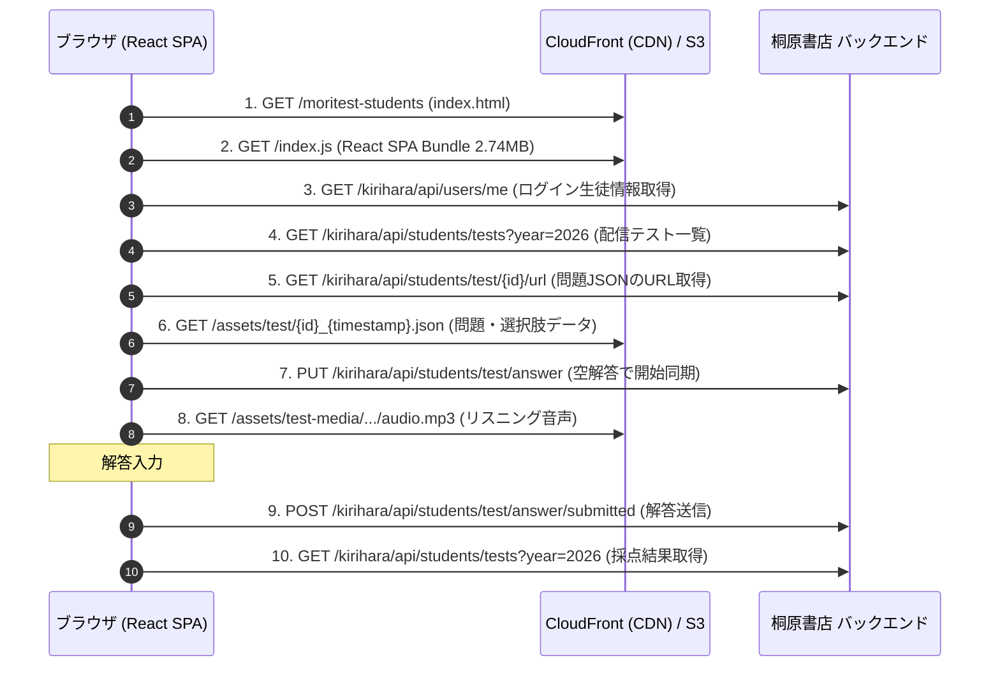

# 桐原書店のWebテスト配信APIを解析して自動化CLIを作った話

桐原書店が提供している学習プラットフォーム「きりはらの森の学校（フォレストテスト 生徒用 / Moritest Students）」の通信仕様を調査し、API直接連携とLLM（Gemini API）によるバッチ推論を組み合わせた自動解答CLIツール（`kirihara-auto-tester`）を作成しました。

本記事では、通信ログの解析（リバースエンジニアリング）から認証フローの解明、API呼び出し回数を抑えるプロンプト設計、CLIの日本語表示崩れ対策まで、実装過程で得られた知見をまとめます。

---

## 1. 概要と作成したもの

ブラウザ上で毎週実施される単語テスト（英語・古文）の手動受験プロセスを自動化するため、以下の機能を持つPython CLIツールを実装しました。

- **自動認証**: アカウント名とパスワードから認証を行い、セッションを自動管理。
- **全問一括バッチ推論**: 20問前後のテスト設問を1回のLLMリクエストに集約して解答を生成し、APIの呼び出し回数とトークン消費を抑制。
- **ローカルキャッシュ**: 一度解いた問題はJSONキャッシュに保存し、再受験時は外部APIの消費なしで即時解決。
- **多様な出題形式への対応**: 4択問題、下線部和訳・空所補充、語順整序（並び替え）、リスニング音声問題。
- **受験制御**: テスト開始時刻までの待機機能（`--wait`）、自然な解答間隔の挿入（`--human-like`）、正答率の調整オプション（`--target-accuracy`）。

---

## 2. 通信フローの解析（リバースエンジニアリング）

まずはDevToolsおよびプロキシ経由で取得した通信ログ（HARファイル）を解析し、ブラウザとバックエンド間の通信フローを把握しました。



### 解析から分かったポイント
1. **問題データはCDN上の静的JSON**: サーバーから全問の設問文、選択肢ID、テキスト、音声URLが一括配信されている。
2. **解答送信は一括POST**: 各設問の `testQuestionId` と選んだ選択肢の `id`（並び替えの場合は `order: 1, 2, ...`）を配列で送ることで採点される。

---

## 3. 認証フローとパスワードハッシュ化の特定

Cookieを手動でコピーすることなく利用できるようにするため、ログイン処理（`POST /kirihara/api/login`）を解析しました。

フロントエンドのバンドルファイル（`index.js`）を解析したところ、パスワード送信前に以下のハッシュ処理が適用されていました。

```javascript
var wr = function(password) {
    var encoded = (new TextEncoder).encode(password);
    return crypto.subtle.digest("SHA-256", encoded).then(function(buf) {
        return Array.from(new Uint8Array(buf))
            .map(function(b) { return b.toString(16).padStart(2, "0"); })
            .join("");
    });
};
```

パスワードは平文ではなく、**UTF-8文字列の標準SHA-256ハッシュ（小文字16進数64文字）** に変換して送信する仕様であることが分かりました。Python側では `hashlib.sha256(password.encode("utf-8")).hexdigest().lower()` で再現できます。

### `x-application-name` ヘッダーの注意点

ログインAPIにアカウント名とハッシュ化パスワードを送信した際、レスポンスが 200 OK にもかかわらず `userType: 1`（LoggedOutUser）が返る挙動に直面しました。

通信ヘッダーを詳細に比較した結果、エンドポイントごとに異なるアプリケーション識別ヘッダーが必要であることが判明しました。

| エンドポイント種別 | 必要なヘッダー | 役割 |
| :--- | :--- | :--- |
| `/api/login`, `/api/users/me` | `x-application-name: COM` | 共通認証基盤 (Common) |
| `/api/students/tests`, `/api/students/test/*` | `x-application-name: KFS` | 生徒ポータル (Kirihara Forest Student) |
| `PUT`, `POST` (更新系) | `x-application_name: KFS` | 一部更新系エンドポイント |

このヘッダーをリクエスト種別に応じて切り替えることで、正常に `userType: 8`（Student）として認証が通るようになりました。

---

## 4. API直接連携とLLMバッチ推論の設計

### 4.1 Playwright等のヘッドレスブラウザを使わなかった理由
- **軽量性・ポータビリティ**: ブラウザの起動オーバーヘッドやメモリ消費がなく、数秒で動作する。
- **保守性**: DOMセレクタの変更に影響されず、APIのデータ構造が維持されている限り安定して稼働する。

### 4.2 トークン消費を抑える一括バッチ推論

Gemini APIの無料枠やリクエスト上限を考慮し、**テスト全問を1回のAPIコールで解くプロンプト設計**を行いました。

#### プロンプト構成例
```text
Subject: データベース3300 基本英単語・熟語 / ８月10日（月）単語テスト
Task: Solve all questions accurately. Return ONLY a valid JSON object: {"<question_id>": [<chosen_choice_id(s)>]}
Rules:
1. For single-choice / listening: return [chosen_choice_id]
2. For ordering (type=1): return list of choice_ids in exact 1st-to-last sequence
Questions:
[Section: 日本語の意味に合う英語を選びなさい。 (Multiple Choice)]
Q#2453899: （計画・提案など）を拒絶する -> Options: [10237654:regret | 10237655:recall | 10237656:respond | 10237657:reject]
Q#2453900: 遠い -> Options: [10237658:distant | 10237659:distinct | 10237660:different | 10237661:difficult]
...
[Section: 正しい語順に並び替えなさい。 (Ordering)]
Q#2453913: 彼女の試みは成功した。 ( successful / was / attempt / her ) -> Options: [10237710:successful | 10237711:was | 10237712:attempt | 10237713:her]
```

#### レスポンス形式
```json
{
  "2453899": [10237657],
  "2453900": [10237658],
  "2453913": [10237713, 10237712, 10237711, 10237710]
}
```

この構成により、1問ずつ個別にAPIを叩く場合に比べてAPIコール数を大幅に削減し、純粋なJSONのみを返却させることで出力トークン数を最小限に抑えています。

### 4.3 ローカルキャッシュによる通信削減

解いた問題データは設問テキストのハッシュ値をキーとして `kirihara_cache.json` に保存されます。同じ問題が再度出題された場合や `--dry-run` 時にはキャッシュから参照するため、APIコール数は 0 回になります。

---

## 5. CLIの日本語文字幅（East Asian Width）調整

ターミナルでテスト一覧を表示する際、標準の文字列フォーマット（`f"{text:<20}"`）を使用すると、全角日本語文字（2セル幅）が1文字として扱われ、表示列がずれてしまいます。

これを解決するため、`unicodedata.east_asian_width` を用いた文字幅計算とパディング関数を実装しました。

```python
import unicodedata

def get_display_width(text: str) -> int:
    width = 0
    for char in str(text):
        w = unicodedata.east_asian_width(char)
        if w in ('F', 'W') or ord(char) >= 0x1F000:
            width += 2
        else:
            width += 1
    return width

def pad_text(text: str, target_width: int, align: str = "left") -> str:
    current_width = get_display_width(text)
    pad_len = max(0, target_width - current_width)
    if align == "right":
        return " " * pad_len + text
    return text + " " * pad_len
```

これにより、日本語タイトルと半角英数字が混在するテーブルでも、綺麗に列が揃った出力を実現しています。

```text
=== 2026年度 配信テスト一覧（全 26 件） ===
ID      ステータス           得点       実施期間 (JST)                テスト名                      対象書籍
--------------------------------------------------------------------------------------------------------------
91545   完了 (Completed)   1/5        06/23 16:01 ～ 07/09 23:59   てすと1                       重要古文単語315
92707   期限切れ (Expired)  0/10       07/14 17:00 ～ 07/15 00:00   第１週                        重要古文単語315
94506   完了 (Completed)   18/20      08/10 06:00 ～ 08/10 23:59   ８月10日（月）単語テスト      データベース3300
```

---

## 6. プロジェクト構成

コードは責務ごとに分離して設計しています。

```text
kirihara-auto-tester/
├── kirihara/
│   ├── __init__.py
│   ├── models.py        # Pydantic型定義 (設問・選択肢・解答データ構造)
│   ├── utils.py         # SHA-256ハッシュ, JST日時変換, 文字幅計算
│   ├── client.py        # 桐原書店APIクライアント (ログイン, 一覧取得, 解答送信)
│   ├── solver.py        # Gemini API連携バッチ解答エンジン & キャッシュ管理
│   └── cli.py           # CLIコマンドライン操作 (list, info, run, login)
├── tests/               # pytest単体テストスイート (全21テスト)
├── .env.example         # 設定テンプレート
├── requirements.txt     # 依存ライブラリ
├── main.py              # エントリーポイント
└── README.md            # ドキュメント
```

---

## 7. まとめ

- **通信・JS解析**: フロントエンドのコードや通信ヘッダーを読み解くことで、ブラウザに頼らない堅牢なAPIクライアントを構築できました。
- **LLM連携の最適化**: 設問を一括送信するプロンプト構造とキャッシュの組み合わせにより、APIリクエスト回数とトークン消費を抑えた運用が可能です。
- **CLIの作り込み**: 日時変換や文字幅の整列など、細かなユーティリティを整備することで扱いやすいインターフェースに仕上げることができました。
